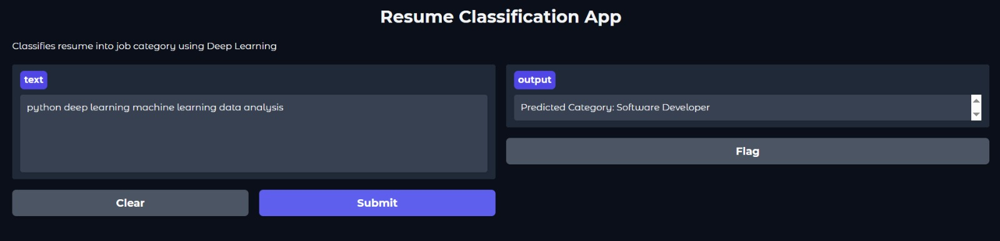

# Resume-Classification-DeepLearning
Resume Classification using LSTM with Gradio UI
# 🧠 Resume Classification using Deep Learning

## 📌 Project Overview

This project builds a **Resume Classification System** using **LSTM (Deep Learning)** and provides an interactive UI using Gradio.

The system classifies resumes into categories like:

* Data Science
* Software Developer
* HR
* Sales
* Web Developer

---

## 🎯 Objective

To automatically classify resume text into job categories using deep learning techniques.

---

## 🛠️ Technologies Used

* Python
* TensorFlow / Keras
* NumPy
* Scikit-learn
* Gradio

---

## 🧠 Model Details

* Tokenization + Padding
* LSTM Neural Network
* Softmax classification

---

## ▶️ How to Run

1. Open the notebook in Google Colab
2. Run all cells
3. Launch Gradio interface
4. Enter resume text and get prediction

---

## 📸 Output

---

## 📊 Results

* Model successfully classified resume text
* Gradio UI provided real-time predictions
* White background UI improved readability
* Demonstrates practical deep learning application

---

## 🔮 Future Improvements

* Use large real-world resume dataset
* Improve model accuracy
* Deploy as web application

---

